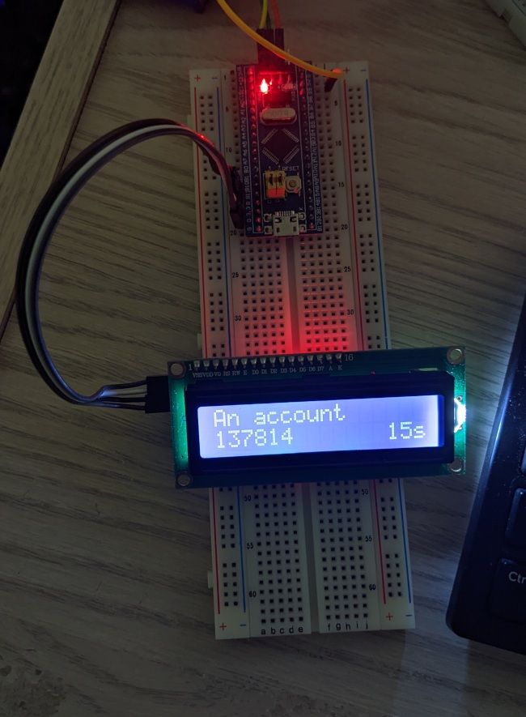

# TOTP on STM32

A bare-metal implementation of two-factor authentication using the TOTP standard
([RFC6238](https://www.rfc-editor.org/rfc/rfc6238)) on the popular
'[Blue Pill](https://stm32-base.org/boards/STM32F103C8T6-Blue-Pill.html)'
STM32F103 based microcontroller board. 

## Description

This is a little project done to get a solid understanding of low-level
concepts, such as implementing drivers for hardware using register definitions
only, driving hardware through common interfaces (e.g. I²C, UART, SPI, ...),
among others. Also implemented the crypto functions (SHA1, HMAC) needed, using
RFCs and textbooks as a guide. No use of newlib or stdio, and libc startup
was disabled in the CMSIS GCC example startup.s file.\
\
Drivers for all peripherals needed are implemented using register definitions
from
[CMSIS source](https://github.com/STMicroelectronics/STM32CubeF1/tree/master/Drivers/CMSIS/Device/ST/STM32F1xx)
as described in the STM32F103
[reference manual](https://www.st.com/resource/en/reference_manual/cd00171190-stm32f101xx-stm32f102xx-stm32f103xx-stm32f105xx-and-stm32f107xx-advanced-arm-based-32-bit-mcus-stmicroelectronics.pdf).
Drivers for devices such as the LCD are also implemented directly from their
datasheets (see source for reference).\
\
Note that resets of the backup domain (e.g. powering off board with no coin cell
battery attached to 3VSB) will reset time to the date when the application was
compiled. Still working on the feature to set time at startup via user interface
(see [TODO](#TODO)).

### Requirements
* An STM32F103 based board
   *  This project uses both the high-speed and low-speed external crystals,
   though the values are changeable in the Makefile
   * See [Wiring](#Wiring) for which pins need to be exposed, though this is
   changeable in the source
* A programmer such as ST-Link
* A common [LCD 16x02 with I²C adapter](http://wiki.sunfounder.cc/index.php?title=I%C2%B2C_LCD1602)
* Two buttons to cycle up and down through stored codes
* (optional) 3.3v coin cell battery

### Wiring

* The LCD is currently assigned on I²C pins B10 (SCL) and B11 (SDA)
* The up and down buttons are assigned on A0 and A1 respectively, with active
high signaling
* (optional) Coin cell battery can be connected to 3VB to preserve RTC through
system resets

### Configuration

Add names, and keys (in Base32), to 'src/storage.c'. Currently working on
getting user interface to add codes and change time (see [TODO](#TODO)). Can
also change HSE_VALUE and LSE_VALUE in the Makefile to suit your board.

### Building

Requires ARM EABI GCC compiler and optionally OpenOCD (or whatever software
your programmer uses, e.g. st-flash). For example, in Arch Linux:
```
pacman -Syu arm-none-eabi-gcc openocd
```

Then to build:
```
mkdir build
make BUILD_DIR=build
```

and to flash using OpenOCD with an ST-Link programmer:
```
make flash
```

## Demo



## TODO

* Implement a driver for a rotary encoder and allow user to input keys and
change the time
    * Make an EEPROM driver to run on flash storage to store keys
* Make peripheral drivers more robust (e.g. reset I²C bus when slave device is
stuck)

## License

This project is licensed under The MIT License (MIT) - see the [LICENSE](LICENSE) file for details.
